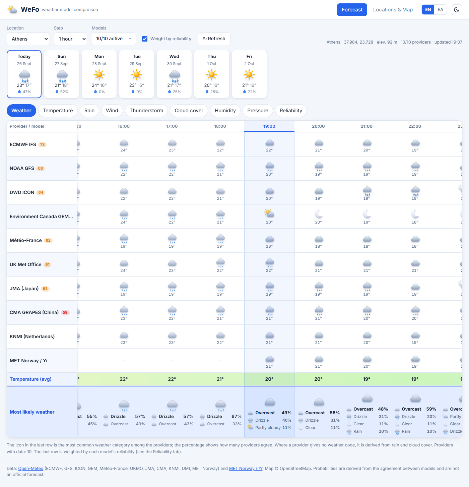
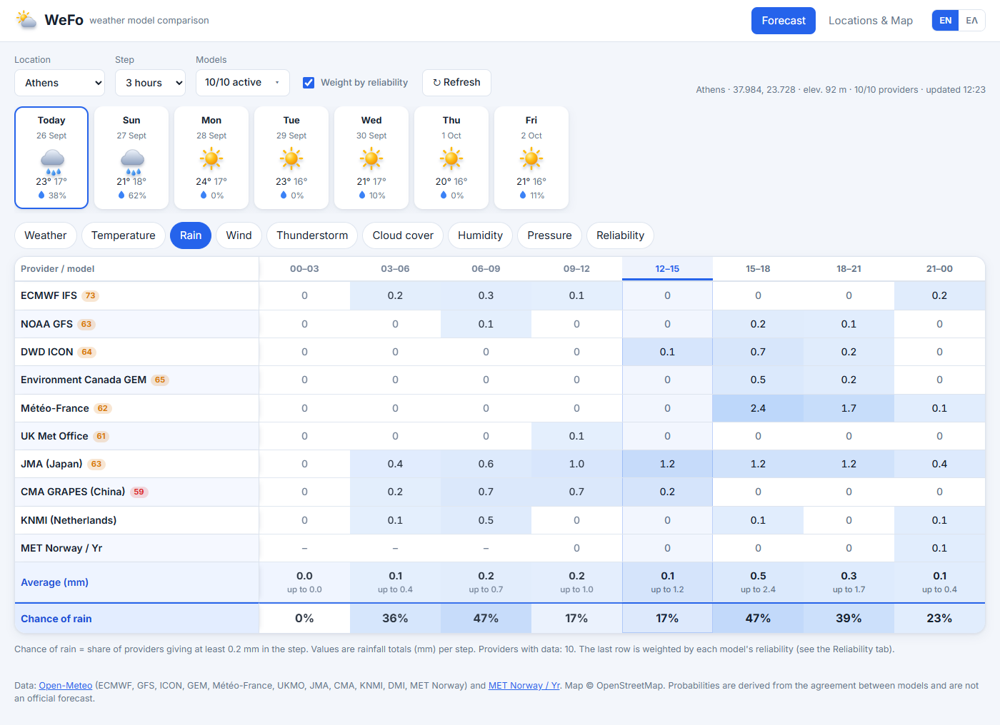
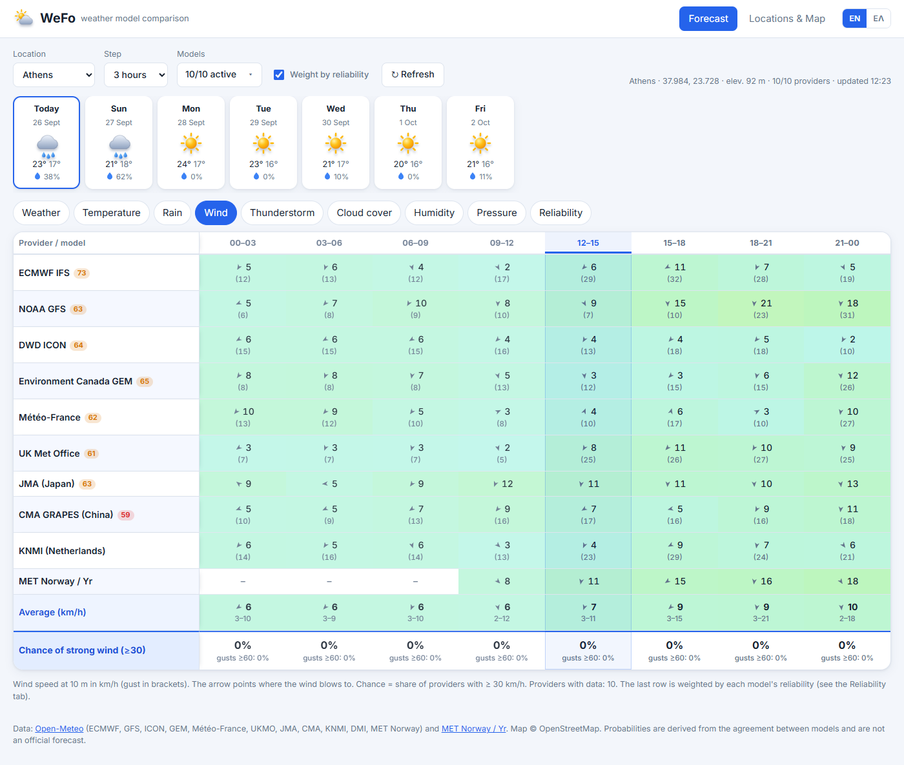
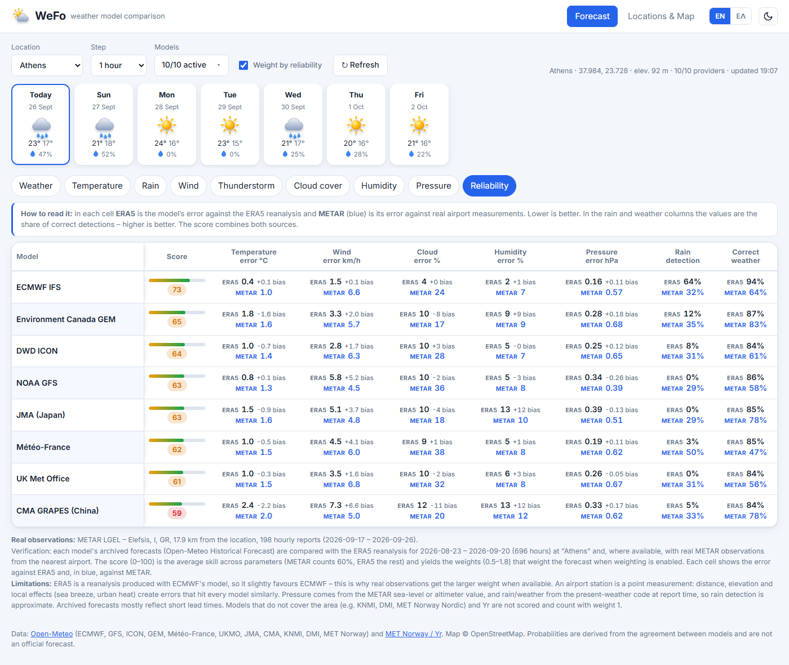
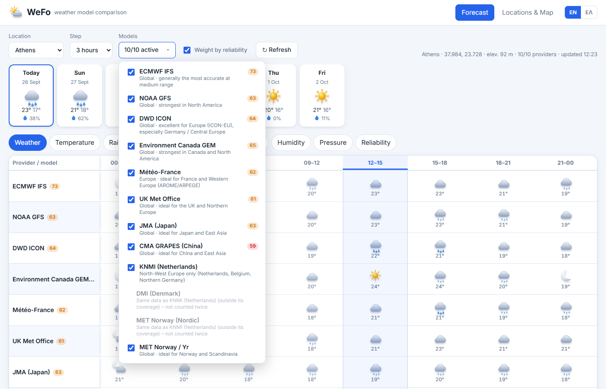
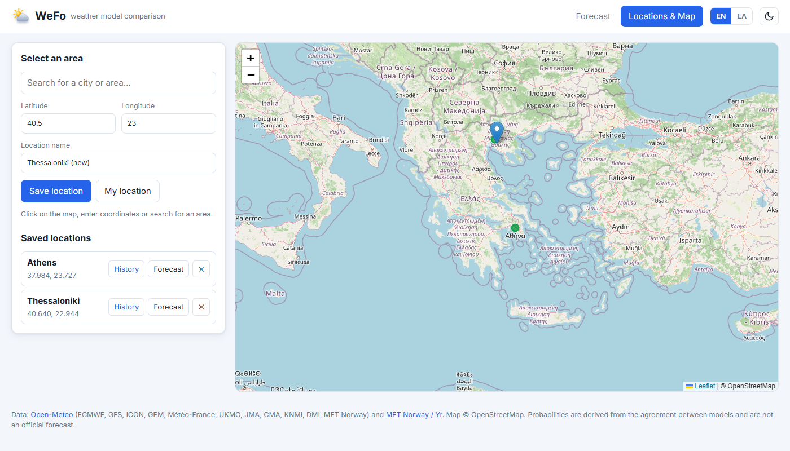
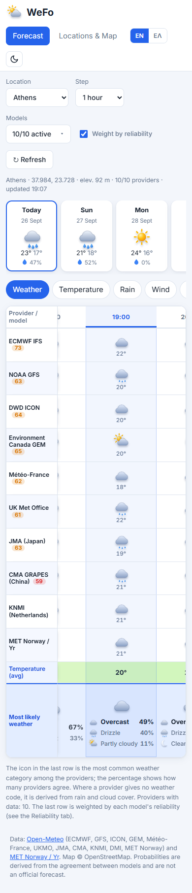
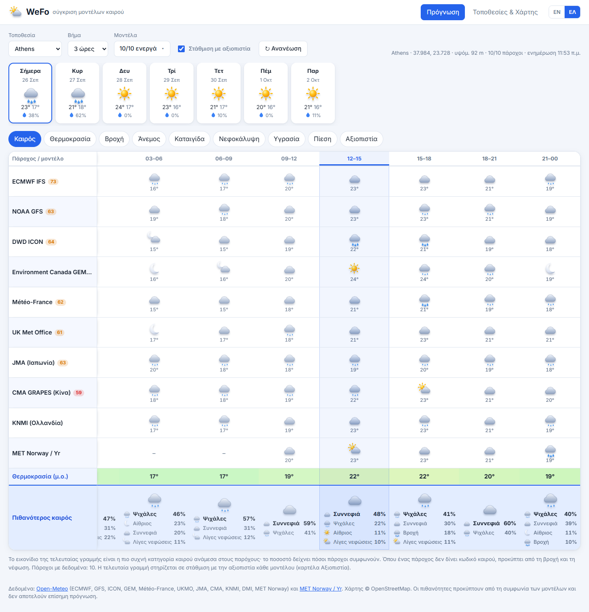

# WeFo – weather model comparison

WeFo is a small self-hosted web app that puts the forecasts of many **free** weather models side by side, hour by hour, and adds a final row with a **probability derived from how much the models agree** (optionally weighted by how reliable each model has recently been for your location).

- Backend: **PHP 8** + **SQLite** (no framework, no Composer)
- Frontend: plain **HTML / CSS / JavaScript** (no build step), [Leaflet](https://leafletjs.com/) for the map
- UI languages: **English** (default) and **Greek** – switch with the `EN | ΕΛ` buttons in the header
- **Light / dark theme** – follows your system setting; use the sun/moon button next to the language switch to override it
- No API keys, no accounts

> The probabilities are a measure of model agreement. They are **not** an official forecast and must not be used for safety-critical decisions.

---

## Screenshots

**Forecast – weather** (one row per model, last row = most likely weather with the share of every category; the current interval is highlighted)



**Rain** – per-model rainfall per step, average and chance of rain



**Wind** – speed, direction arrow and gusts per model, chance of strong wind



**Reliability** – per-model score, error and bias against ERA5 (last 28 days) and, in blue, against real METAR observations of the nearest airport



**Models drop-down** – enable/disable models, regional notes and reliability scores



**Locations & Map** – pick a point on the map, search, save locations



**Responsive layout** (phone) and **Greek UI**

<p>
  
  &nbsp;
  
</p>

---

## Table of contents

1. [Screenshots](#screenshots)
2. [What it shows](#what-it-shows)
3. [How it works](#how-it-works)
4. [Requirements](#requirements)
5. [Installation](#installation)
6. [Configuration](#configuration)
7. [Project structure](#project-structure)
8. [HTTP API](#http-api)
9. [Data, privacy and external services](#data-privacy-and-external-services)
10. [Limitations](#limitations)
11. [Adding a language](#adding-a-language)
12. [Troubleshooting](#troubleshooting)

---

## What it shows

### Locations & Map

- Pick a place by **clicking on the map**, typing **latitude/longitude**, **searching by name**, or using **My location**.
- The name is filled in automatically (reverse geocoding) and you can edit it.
- **Save** the location: it is stored in the SQLite database and appears in the *Location* drop-down of the Forecast page. Saved locations are shown on the map and can be deleted.

### Forecast

Choose a saved location and you get:

1. **Day cards** (7 days): most likely weather icon, expected high / low, chance of rain (≥ 1 mm) and, when relevant, chance of thunderstorm.
2. **Parameter tabs**, each showing one table – one row per provider/model, one column per time step:

   | Tab | Provider cells | Second-to-last row | **Last row (probability)** |
   |---|---|---|---|
   | **Weather** | weather icon + temperature | average temperature | every weather category predicted by the models with its share (e.g. *Clear 55 %, Overcast 27 %, Partly cloudy 18 %*) – the top one also as a large icon |
   | **Temperature** | °C, colour-coded | average, min–max | agreement % and ± standard deviation |
   | **Rain** | mm per step | average, max | chance of rain (share of models giving ≥ 0.2 mm in the step) |
   | **Wind** | 10 m speed km/h, arrow = direction the wind blows towards, gust in brackets | average and range, mean direction | chance of strong wind (share of models ≥ 30 km/h) and of gusts ≥ 60 km/h |
   | **Thunderstorm** | CAPE (J/kg) and a bolt when the model forecasts a thunderstorm | average CAPE | chance of thunderstorm |
   | **Cloud cover / Humidity / Pressure** | value, colour-coded | average, min–max | agreement % |
   | **Reliability** | see [Model verification](#model-verification-reliability-tab) | | |

3. **Step**: 1, 3, 6 or 12 hours. Values are aggregated per step (rain = sum, gust/CAPE = max, weather code = most severe, wind direction = speed-weighted circular mean, others = mean).
4. The **current time interval is highlighted** (whole column) and, when the table needs horizontal scrolling, it is **automatically centred**. Past intervals are slightly dimmed.
5. **Models** drop-down: enable/disable individual models (see below).
6. **Weight by reliability** checkbox: turn reliability weighting on/off.
7. **Refresh** forces a fresh download (otherwise data is cached for 30 minutes).

### Models drop-down

- Each model has a checkbox, a short note about **which regions it is best for**, and its reliability score (0–100) once verification has loaded.
- Disabled models disappear from the tables and from all averages and probabilities. At least one model must stay enabled.
- The choice is **per browser** (saved in `localStorage`, see [privacy](#data-privacy-and-external-services)) and applies to all locations.
- Models that cannot cover the selected location are listed under *No coverage for this location*.
- Some regional models (KNMI, DMI, MET Norway Nordic) silently return a **copy of a global model** outside their domain. WeFo detects identical series and counts them **only once**; they are shown greyed out with the note *Same data as …*.

---

## How it works

### Data sources

| Provider | How it is fetched |
|---|---|
| ECMWF IFS, NOAA GFS, DWD ICON, Environment Canada GEM, Météo-France, UK Met Office, JMA, CMA GRAPES, BOM ACCESS, KNMI, DMI, MET Norway Nordic | one request to the [Open-Meteo forecast API](https://open-meteo.com/) with the `models=` parameter |
| MET Norway / Yr (global) | directly from the [MET Norway Locationforecast API](https://api.met.no/) (converted to the same hourly format) |

Real observations used only for the reliability score come from [aviationweather.gov](https://aviationweather.gov/data/api/) (METAR). Models that return no data for the location are dropped automatically. Everything is fetched **server-side** (`api/forecast.php`) and cached in SQLite for **30 minutes** per location.

### Consensus and probability

For every time step and every parameter WeFo collects one value per active provider and computes:

- **Average / range** – (weighted) mean, min and max of the provider values.
- **Weather category** – WMO weather codes are grouped into *clear, partly cloudy, overcast, fog, drizzle, rain, snow, thunderstorm*. Each provider votes for its category; the shares are shown as percentages. If a provider gives no weather code it is derived from precipitation, temperature (snow), CAPE and cloud cover.
- **Chance of rain** – share of providers with ≥ **0.2 mm** in the step.
- **Chance of strong wind** – share of providers with ≥ **30 km/h** (Beaufort 5).
- **Chance of thunderstorm** – each provider gives a signal: weather code 95–99 = 1, CAPE ≥ 1000 J/kg = 0.5, otherwise 0; the chance is the (weighted) mean signal.
- **Agreement** (temperature, cloud, humidity, pressure) – `100 % × (1 − σ / tolerance)`, where σ is the standard deviation between providers and the tolerance is 4 °C, 50 %, 25 %, 4 hPa respectively (0 % when σ ≥ tolerance).

The thresholds are constants at the top of `js/app.js` (`RAIN_THR`, `WIND_THR`, `TOL`).

### Model verification (Reliability tab)

To find out which models have recently been closest to reality **for your location**, `api/verify.php` compares every model's *archived forecasts* (Open-Meteo **Historical Forecast API**) with two references:

1. **ERA5 reanalysis** (Open-Meteo **Archive API**) – a gridded "what actually happened" for the last **28 days** (ending 6 days ago, because ERA5 is published with a delay). Available everywhere, but it is a model product, produced with ECMWF's system, so it slightly favours ECMWF.
2. **Real METAR observations** – the hourly weather reports of the **nearest airport station** within 60 km (from [aviationweather.gov](https://aviationweather.gov/data/api/), no key needed). Roughly the last 1–2 weeks (the API returns up to ~400 reports). METAR gives measured temperature, dew point (→ relative humidity), wind, pressure, cloud cover and present weather (rain, snow, thunderstorm, fog).

For each model and reference it computes: mean absolute error and bias for temperature, wind, cloud cover, humidity and pressure; the *critical success index* for detecting wet hours; and the share of hours with the correct weather category (drizzle and rain are treated as one category for this comparison).

**Combining the two:** per parameter, `skill = 0.6 × METAR skill + 0.4 × ERA5 skill` when at least 48 matched hourly observations exist; otherwise ERA5 alone is used. Observations get the larger share because ERA5 is not independent of the models being judged. The **score (0–100)** is the mean skill across parameters, and the skills are turned into **weights between 0.5 and 1.8** (average = 1) per parameter. With *Weight by reliability* enabled, the averages, chances and weather-category shares use these weights, so better models count more. Results are cached for 24 hours per location.

In the Reliability table every cell shows the error against ERA5 and, in blue, the error against METAR; the note under the table names the station, its distance and the number of reports used.

Notes and caveats:

- An airport is a point measurement. Distance, elevation and local effects (sea breeze, urban heat) add errors that affect all models similarly; the station is shown so you can judge how representative it is.
- Pressure comes from the METAR sea-level pressure (or altimeter setting), and rain/weather from the *present-weather* code at report time – rain detection against METAR is therefore approximate.
- Models without archived data for the area (regional models outside their domain) and Yr are not scored and count with weight 1. Rain weights are only used when the period contains enough rain events to be meaningful.
- If no METAR station with enough reports is near the location, ERA5 alone is used and the note says so.

---

## Requirements

- **PHP 8.0+** (developed on 8.4) with the extensions **`pdo_sqlite`** and **`curl`** (`mbstring` is optional)
- A web server that can run PHP (Apache, Nginx + PHP-FPM, or the built-in PHP server for development)
- Write permission for the web-server user on the `data/` directory
- Outbound HTTPS access to `open-meteo.com`, `api.met.no`, `aviationweather.gov`, `nominatim.openstreetmap.org`, `unpkg.com`, `fonts.googleapis.com` and OpenStreetMap tile servers

## Installation

### Quick start (local development)

```bash
git clone https://github.com/santonoreg/weather_forecast.git
cd weather_forecast
php -S 127.0.0.1:8099
```

Open <http://127.0.0.1:8099/>, go to **Locations & Map**, save a location, then open **Forecast**.

> With PHP's built-in server the `data/` directory is not protected by `.htaccess`. Use it for development only.

### Laragon / XAMPP / WAMP (Windows)

1. Copy or clone the project into the web root, e.g. `C:\laragon\www\wefo` (or `htdocs\wefo`).
2. Make sure `extension=pdo_sqlite` and `extension=curl` are enabled in `php.ini`.
3. Open `http://localhost/wefo/`.

### Ubuntu / Debian VPS with Apache

```bash
sudo apt update
sudo apt install apache2 php php-sqlite3 php-curl php-mbstring libapache2-mod-php git

cd /var/www
sudo git clone https://github.com/santonoreg/weather_forecast.git wefo

# the web-server user must be able to write the database
sudo mkdir -p /var/www/wefo/data
sudo chown -R www-data:www-data /var/www/wefo/data
sudo chmod 775 /var/www/wefo/data
```

`data/.htaccess` already denies web access to the database; this requires `AllowOverride All` (or at least `AllowOverride AuthConfig`) for the directory:

```apache
<Directory /var/www/wefo>
    AllowOverride All
    Require all granted
</Directory>
```

Enable HTTPS (recommended), e.g. with Let's Encrypt: `sudo apt install certbot python3-certbot-apache && sudo certbot --apache`.

### Ubuntu / Debian VPS with Nginx + PHP-FPM

```bash
sudo apt install nginx php-fpm php-sqlite3 php-curl php-mbstring git
cd /var/www && sudo git clone https://github.com/santonoreg/weather_forecast.git wefo
sudo mkdir -p /var/www/wefo/data && sudo chown -R www-data:www-data /var/www/wefo/data && sudo chmod 775 /var/www/wefo/data
```

Nginx does not read `.htaccess`, so **block the database directory explicitly**:

```nginx
server {
    server_name example.com;
    root /var/www/wefo;
    index index.html;

    location ^~ /data/ { deny all; return 404; }

    location ~ \.php$ {
        include snippets/fastcgi-php.conf;
        fastcgi_pass unix:/run/php/php-fpm.sock;   # adjust to your PHP-FPM socket
    }
}
```

### Installing under a sub-path (e.g. `https://example.com/forecast/`)

Just put the project in a sub-folder of the web root. All URLs in the app are relative, so no configuration is needed.

### Updating

```bash
cd /var/www/wefo && git pull
```

Then hard-refresh the browser (Ctrl+F5). The CSS/JS URLs carry a `?v=` version parameter in `index.html` to avoid stale caches; bump it when you change those files.

## Configuration

There is no config file. The relevant constants are:

| Where | Constant | Meaning |
|---|---|---|
| `api/forecast.php` | `CACHE_TTL` (1800) | forecast cache in seconds |
| `api/forecast.php` | `$MODELS` | Open-Meteo model ids and display names |
| `api/verify.php` | `WINDOW_DAYS` (28), `LAG_DAYS` (6), `VERIFY_TTL` (86400) | ERA5 window, ERA5 delay, cache |
| `api/verify.php` | `MAX_STATION_KM` (60), `MIN_OBS` (48), `OBS_WEIGHT` (0.6), `METAR_HOURS` (360) | METAR station distance limit, minimum matched observations, METAR share of the blended skill, how far back to ask for reports |
| `api/verify.php` | `$TOL` | error at which a parameter's skill reaches 0 |
| `api/db.php` | `http_get()` | User-Agent and cURL options |
| `js/app.js` | `RAIN_THR`, `WIND_THR`, `TOL` | thresholds for the probabilities |

**Please change the User-Agent** in `api/db.php` (`wefo-weather-compare/1.0 …`) to identify your own installation with a contact address – [MET Norway requires this](https://api.met.no/doc/TermsOfService).

## Project structure

```
index.html          single-page UI (Forecast + Locations views)
css/style.css       styles (light/dark, responsive)
js/i18n.js          translations (en, el) and language switching
js/icons.js         3D-style SVG weather icons, WMO code → category mapping
js/app.js           UI logic: tables, consensus, weighting, map, preferences
api/db.php          SQLite connection, JSON helpers, HTTP client, error handling
api/locations.php   GET / POST / DELETE saved locations
api/geocode.php     place search (Open-Meteo) and reverse geocoding (Nominatim)
api/forecast.php    multi-model forecast aggregation + 30 min cache
api/verify.php      model verification against ERA5 + METAR observations, 24 h cache
data/               SQLite database (created automatically, git-ignored)
```

Database tables (created automatically): `locations(id, name, lat, lon, created_at)` and `cache(k, body, fetched_at)`.

## HTTP API

| Endpoint | Description |
|---|---|
| `GET api/locations.php` | list saved locations |
| `POST api/locations.php` | body `{"name","lat","lon"}` – save a location |
| `DELETE api/locations.php?id=ID` | delete a location |
| `GET api/geocode.php?q=TEXT&lang=en\|el` | search places |
| `GET api/geocode.php?lat=..&lon=..&lang=en\|el` | reverse geocode a point |
| `GET api/forecast.php?lat=..&lon=..[&refresh=1]` | normalised hourly forecasts from all providers |
| `GET api/verify.php?lat=..&lon=..` | per-model scores, errors (vs ERA5 and vs METAR), weights and the METAR station used |

Errors are returned as `{"error": "message"}` with an HTTP 4xx/5xx status.

> The saved-locations list is **shared by everyone who can open the site** (there are no user accounts). If you expose the app publicly, protect it with HTTP basic auth or your own login.

## Data, privacy and external services

- **Server side:** saved locations and cached API responses in `data/wefo.sqlite`. No personal data or cookies.
- **Browser side (`localStorage`, never sent to the server):** `wefo.lang` (language), `wefo.theme` (light/dark), `wefo.disabled` (disabled models), `wefo.weighted` (reliability weighting on/off), `wefo.loc` (last selected location).
- **Requests made by the server:** coordinates of the selected locations go to Open-Meteo, MET Norway, aviationweather.gov (to find the nearest METAR station) and (reverse geocoding) Nominatim.
- **Requests made by the browser:** map tiles (OpenStreetMap), Leaflet (unpkg CDN) and the Inter font (Google Fonts).
- **Terms:** Open-Meteo's free API is for **non-commercial** use with fair-use limits; Nominatim, MET Norway and aviationweather.gov (NOAA) have their own usage policies. Caching in this app keeps usage low, but check the terms before any commercial or high-traffic deployment.

## Limitations

- ERA5 is a reanalysis produced with ECMWF's model, so on its own it slightly favours ECMWF; real METAR observations reduce this bias where a station is near, but an airport is a single point that may not represent your exact spot.
- Archived forecasts mostly represent short lead times, so the score reflects short-range skill more than day-5 skill.
- Weather icons for models without a weather code are derived heuristically.
- cURL certificate verification is disabled in `api/db.php` (`CURLOPT_SSL_VERIFYPEER => false`) so it works out of the box on Windows without a CA bundle. On a production server, remove that line (or point cURL at a CA bundle).
- No authentication (see the note above).

## Adding a language

Open `js/i18n.js`, copy the `en` block to a new key (for example `de: { ... }`), translate the values, and add a button `<button data-lang="de">DE</button>` to the `.lang` group in `index.html`. Missing keys automatically fall back to English. Also add the language code to the check in `api/geocode.php` if you want localised place names.

## Troubleshooting

| Symptom | Likely cause / fix |
|---|---|
| *Error 500* when saving a location | `data/` not writable by the web-server user, or `pdo_sqlite` missing. The error message in the app names the cause. |
| *Failed to fetch data from Open-Meteo* | no outbound HTTPS from the server, or the API rate limit was hit – retry later |
| Table looks old after an update | hard refresh (Ctrl+F5); check the `?v=` version in `index.html` |
| Reliability tab empty / "unavailable" | the historical APIs could not be reached; the forecast tabs still work |
| Reliability note says "ERA5 only" | no METAR station with enough recent reports within 60 km – normal for remote locations |
| KNMI / DMI / MET Norway Nordic rows are "greyed out" | they do not cover your location and returned a copy of another model; they are counted once |
